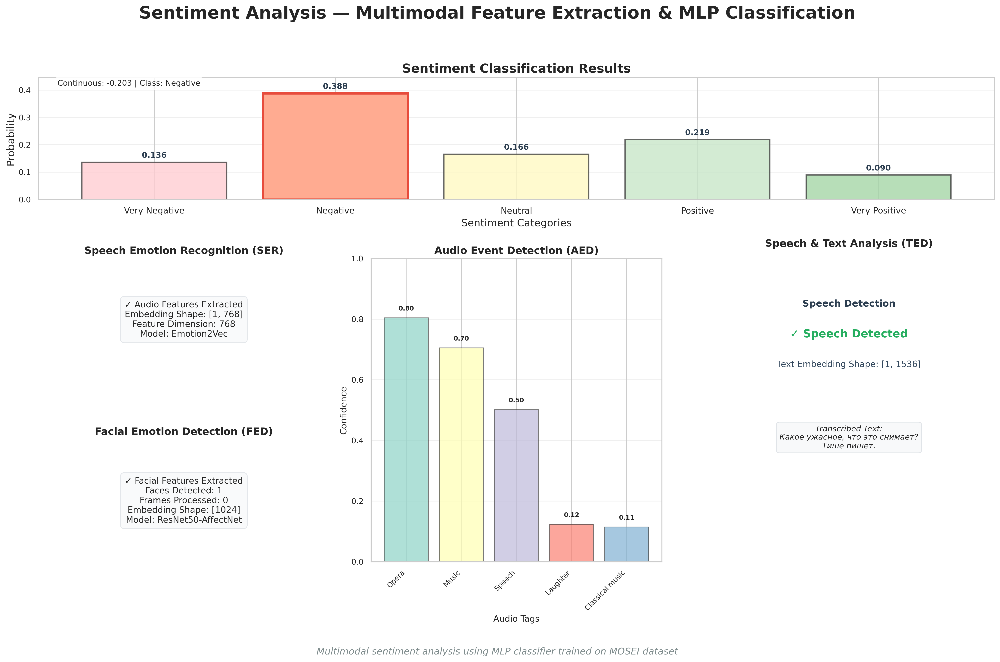

<div align="center">
<h1>Agent-Based Modular Learning for Multimodal Emotion Recognition in Human-Agent Systems</h1>


**Matvey Nepomnyashchiy**<sup>1</sup>, [**Oleg Perezyabov**](https://www.linkedin.com/in/oleg-pereziabov-a6b287254/)<sup>2</sup>, [**Anvar Tliamov**](https://www.linkedin.com/in/anvar-tliamov-840544233/)<sup>3</sup>, [**Stanislav Mikhailov**](https://www.linkedin.com/in/stanislav-mikhailov-821854233/)<sup>4</sup> and [**Ilya Afanasyev**](https://www.linkedin.com/in/ilya-afanasyev-8783291a/)<sup>5</sup>


<a href="None"></a>
<a href='https://github.com/MatNepo/MMEmoRec'></a>
<a href='None'></a>

</div>


Effective human-agent interaction (HAI) relies on accurate and adaptive perception of human emotional states. While multimodal deep learning models—leveraging facial expressions, speech, and textual cues—offer high accuracy in emotion recognition, their training and maintenance are often computationally intensive and inflexible to modality changes. In this work, we propose a novel multi-agent framework for training multimodal emotion recognition systems, where each modality encoder and the fusion classifier operate as autonomous agents coordinated by a central supervisor. This architecture enables modular integration of new modalities (e.g., audio features via emotion2vec), seamless replacement of outdated components, and reduced computational overhead during training. We demonstrate the feasibility of our approach through a proof-of-concept implementation supporting vision, audio, and text modalities, with the classifier serving as a shared decision-making agent. Our framework not only improves training efficiency but also contributes to the design of more flexible, scalable, and maintainable perception modules for embodied and virtual agents in HAI scenarios.

Keywords: Multi-Agent Systems, Emotion Recognition, Multimodal Learning, Modular Architecture, Supervisor Architecture, Agent Coordination, Human-Agent System


Example workflow:
1) Upload a video fragment.
2) Independent agents analyze it across modalities: text, visuals, and audio.
3) The system produces a unified emotion prediction.


Result:



## Citation

If you find this project useful, please consider citing:

```bibtex
@article{nepomny2025multiagent_emotion,
  title={Agent-Based Modular Learning for Multimodal Emotion Recognition in Human-Agent Systems},
  author={Nepomnyashchiy, Matvey and Pereziabov, Oleg and Tliamov, Anvar and Mikhailov, Stanislav and Afanasyev, Ilya},
  journal={arXiv preprint arXiv:NUMBER},
  year={2025}
}
